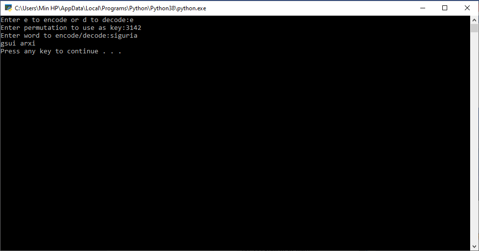

# Siguria_29
CAESAR CIPHER   
1.Udhezime per ekzekutimin e programit  
-caesar cipher(kodi i cezarit) ndryshe njihet edhe si shift cipher dhe ky kod i fsheh mesazhet duke  shtyer secilen shkronje per disa vende ne alfabet.se sa shtyhet nje shkronje varet nga vlera e qelesit qe kemi vendosur si p.sh nese qelesi eshte 2 atehere shkronja A na behet C.  
2.Pershkrimi per secilen komande
-Pershkrimi i komandeve per kodin e cezarit eshte bere brenda kodit me anen e komenteve qe te jete me qarte se per qfare eshte perdorur secila nga komandat.  
3.Rezultatet e ekzekutimit(I gjeni tek folderi images)  
3.1 Rezultatet e ekzekutimit te caesar encrypt(encriptimit me kodin e cezarit)  

3.2 Rezlutatet e ekzekutimit te caesar decrypt

3.3 Rezultatet e ekzekutimit te caesar brute-force

BEALE CIPHER
1.Udhezime per ekzekutimin e programit  
-Ne fillim e krijojm nje folder te zbrazet, pastaj ne ate folder i vendosum fajllin e tipit text edhe ate te tipit python.Pastaj pasi i vendosum ne nje folder hym tek ai folder dhe e hapum nje command line ne kete folder.Pastaj i kemi disa hapa te ekzekutimit:
1.Shenojm python, pastaj Enter.  
2.Shenojm quit(), pastaj Enter.  
3.Shenojm python emri_fajllitpython.py, pastaj Enter.  
5.Pastaj na shfaqet teksti nese deshirojme te encodojme apo decodojme, shtypim sipas deshires ose "e" ose "d", pastaj shtypim Enter.  
6.Shenojm text file si qeles, pastaj Enter.  
7.Pastaj shenojme fjalen qe deshirojme ta kodojme, pastaj shtypim Enter, dhe ne fund na shfaqet fjala e koduar.  
-Beale cipher perdoret per kodimin e nje teksti duke u bazuar ne poziten e atyre shkronjave te tekstit ne nje dokument tjeter(ne rastin tone ne nje tekst file).  
2.Pershkrimi i komandave  
Pershkrimi i shkurte i komandave eshte bere brenda kodit me ane te komenteve.
3.Rezultatet e ekzekutimit  
3.1 Rezultatet e enkriptimit me komanden beale

3.2 Rezultatet e dekriptimit me komanden beale

KOMANDA PERMUTATION
1.Udhezime per ekzekutimin e programit  
-Ne fillim e krijojm nje folder te zbrazet, pastaj ne ate folder e vendosum fajllin e tipit python.Pastaj pasi e vendosum ne nje folder hym tek ai folder dhe e hapum nje command line ne kete folder.Pastaj i kemi disa hapa te ekzekutimit:  
1.Shenojm python, pastaj Enter.  
2.Shenojm quit(), pastaj Enter.  
3.Shenojm python emri_fajllitpython.py, pastaj Enter.  
5.Pastaj na shfaqet teksti nese deshirojme te encodojme apo decodojme, shtypim sipas deshires ose "e" ose "d", pastaj shtypim Enter.
6.Shenojm nje permutacion qe e perdorum si qeles, pastaj Enter.  
7.Pastaj shenojme fjalen qe deshirojme ta kodojme, pastaj shtypim Enter, dhe ne fund na shfaqet fjala e koduar.  
-Komanda permutation e tarnsformon plaintekstin ne blloqe ,duke i ndare ato ne baze te nje permutacioni te caktuar.  
2.Pershkrimi i komandave  
-Pershkrimi i komandave eshte bere te kodi me ane te komenteve perkatese.
3.Rezultatet e ekzekutimit  
3.1 Rezultatet e enkriptimit me komanden permutation(2 shembuj)

3.2 Rezultatet e dekriptimit me komanden permutation(2 shembuj)  

**#KOMANDAT**
#create-user  
#delete-user  
#export-key  
#import-key  
#write-message  
